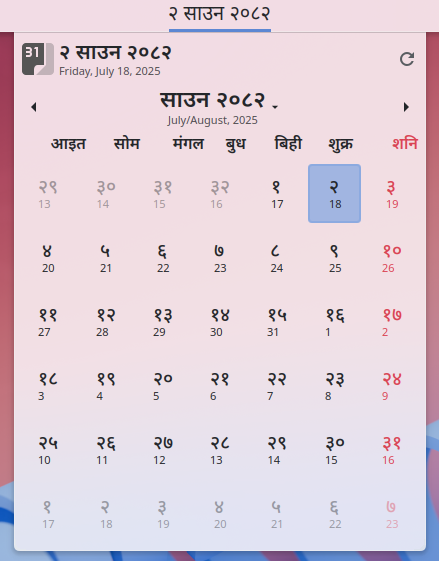
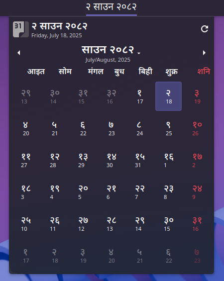

# Nepali Calendar (Plasmoid)

A calendar widget for the Nepali Bikram Sambat (BS) calendar with panel integration for KDE Plasma.  
It enables users to browse Nepali dates in a familiar calendar format.

Available on KDE Store:  
[https://store.kde.org/p/2303034/](https://store.kde.org/p/2303034/)

## Screenshots

<table>
  <tr>
    <td></td>
    <td></td>
  </tr>
</table>

## Features

- Displays Nepali Bikram Sambat calendar.
- View current month or browse other months with previous/next buttons.
- Integration with KDE Plasma panel.
- Lightweight no any external api calls for date information.

---

## Limitations (Current)

- No direct BS ⇄ AD conversion (e.g., you cannot input a BS date and instantly convert to AD).
- Navigation through months is manual (left/right click).

---

## Future Goals

1. Add direct BS ⇄ AD conversion support.
2. Show Tithis and events in calendar view.
4. Add configuration options like date format,font wieght etc.
5. Add custom icons to for some elements.

---

## Author
- Satya Prakash Dahal

## Credits

- Sushil Shrestha – [pyBSDate](https://github.com/SushilShrestha/pyBSDate)  
  (Dataset source for BS ⇄ AD mapping)  
  Licensed under MIT

